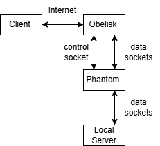
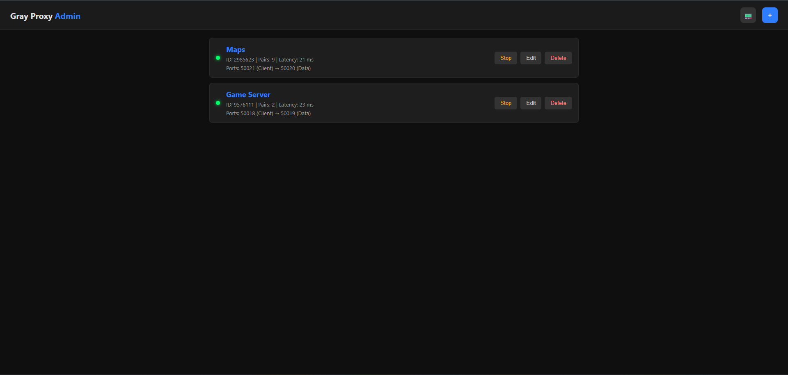

# Obelisk — TCP Proxy for Phantom

**Obelisk** is a TCP proxy that works in tandem with the **Phantom** program. It is designed to forward clients to Phantom through a secure connection, simplifying access to servers behind NAT.

## ⚙️ Overview

- Obelisk should be installed on a machine with a **public IP**.
- It accepts connections from **Phantom** on the data port and establishes a secure connection for further communication.
- Main purpose: **forward clients to Phantom**.
- After authentication, Phantom provides a pool of sockets to wait on.
- A pool of connections is maintained between Phantom and Obelisk (configured on the Phantom side).
- How it works: when a client connects, Obelisk forwards all data through an existing connection to Phantom.
- The data connection between Obelisk and Phantom is **not encrypted intentionally**. Many servers already have encryption, and this avoids unnecessary load.

## 🏗 Architecture

- Client connects to Obelisk
- Obelisk forwards data through a pool of connections to Phantom
- Phantom communicates with the target servers or processes data

## 📄 Phantom Data Format

Obelisk expects Phantom to send initial authorization data in the following binary format:

struct AuthorizationRequest {
    uint32_t ID_CLIENT;   // Unique client ID
    uint32_t POOL_SIZE;   // Number of sockets in the pool
};

## 🚀 How It Works

1. On startup, Obelisk requires a **port range** to allocate for clients.
2. A **web interface is available on port 9000** (currently insecure, no authentication).
3. Incoming clients are automatically forwarded through the Phantom connection pool.
4. Future plans: authentication and secure web interface.

## 📦 Setup and Usage

-port-range — range of ports to allocate to clients.

The web interface is accessible at http://YOUR_IP:9000.
📄 Repository Structure
Obelisk-/

├── src/                # source code

├── CMakeLists.txt      # build configuration

├── LICENSE.txt         # license

└── README.md           # this file

📄 License

The project is licensed under the MIT License — see LICENSE.txt.
